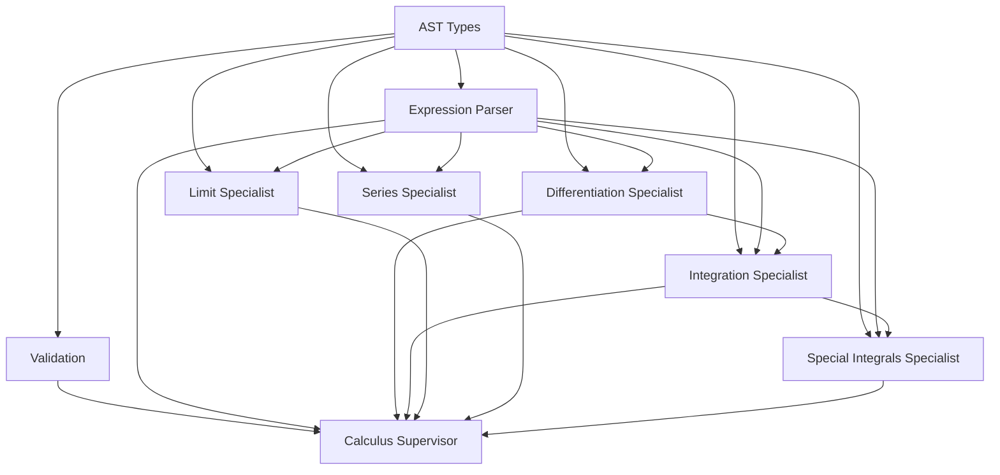

# Native Calculus Engine Decomposition Plan

## Executive Summary

The `native_calculus.py` file (13,330 lines, 507KB) is being decomposed into a supervisor-specialist agent architecture following LangChain patterns.

**Current State**: Monolithic calculus engine with 8 major components in one file
**Target State**: Modular specialist agents coordinated by a supervisor

## File Analysis

### Source File Structure
```
native_calculus.py (13,330 lines)
├── Lines 1-92: Copyright, docstring, imports, safety limits
├── Lines 95-271: AST type definitions (Num, Sym, Add, Mul, Pow, Neg, Func)
├── Lines 274-353: AST constructors (num, sym, add, mul, power, neg, func)
├── Lines 360-544: DifferentiationEngine class (~185 lines)
├── Lines 550-2183: IntegrationEngine class (~1,633 lines)
├── Lines 2188-3273: LimitEngine class (~1,085 lines)
├── Lines 3277-3442: ExprParser class (~165 lines)
├── Lines 3443-8711: High-level API + Special Integral Patterns (~5,268 lines)
│   ├── differentiate(), integrate(), definite_integrate()
│   ├── _try_gaussian_integral() family (~3,500 lines)
│   ├── _try_fresnel_cube_integral(), _try_mills_ratio_integral()
│   ├── _try_lorentzian_power_integral(), _try_semicircle_integral()
│   └── Dozens of specialized pattern matchers
├── Lines 8712-9618: Series Evaluation (~906 lines)
│   ├── series_sum()
│   ├── Convergence tests
│   └── Classic series recognition (Basel, zeta, geometric, etc.)
├── Lines 9619-13282: Native Limit Engine Extensions (~3,663 lines)
│   ├── KNOWN_LIMIT_PATTERNS dictionary
│   ├── L'Hôpital's rule helpers
│   └── Pattern-based limit evaluation
└── Lines 13283-13330: Test suite

### Component Dependencies



## Proposed Architecture

### Directory Structure
```
src/symbo_agentic_reasoners/core/calculus/
├── __init__.py                          # Public API exports
├── calculus_supervisor.py               # Main coordinator (NEW)
├── ast_types.py                         # AST definitions (DONE)
├── validation.py                        # Safety checks (DONE)
├── expression_parser.py                 # String → AST (DONE)
├── calculus_utils.py                    # Shared utilities (TODO)
├── specialists/
│   ├── __init__.py
│   ├── differentiation_specialist.py    # DifferentiationEngine
│   ├── integration_specialist.py        # IntegrationEngine
│   ├── limit_specialist.py              # LimitEngine
│   ├── series_specialist.py             # Series evaluation
│   └── special_integrals_specialist.py  # Special integral patterns
└── tests/
    └── test_calculus_decomposition.py   # Integration tests
```

### Supervisor Pattern

The `CalculusSupervisor` will:
1. Accept operation requests (differentiate, integrate, limit, series)
2. Validate input safety
3. Parse string to AST
4. Route to appropriate specialist
5. Format and return results
6. Handle fallback chains (e.g., special_integrals → integration)

```python
class CalculusSupervisor:
    def __init__(self):
        self.parser = ExprParser()
        self.validator = ExpressionValidator()
        self.diff_specialist = DifferentiationSpecialist()
        self.int_specialist = IntegrationSpecialist()
        self.limit_specialist = LimitSpecialist()
        self.series_specialist = SeriesSpecialist()
        self.special_int_specialist = SpecialIntegralsSpecialist()

    def differentiate(self, expr_str: str, var: str = 'x') -> Tuple[bool, Optional[str], str]:
        # 1. Validate safety
        # 2. Parse to AST
        # 3. Delegate to diff_specialist
        # 4. Format result
        pass

    def integrate(self, expr_str: str, var: str = 'x') -> Tuple[bool, Optional[str], str]:
        # 1. Validate safety
        # 2. Parse to AST
        # 3. Try special_int_specialist first (for definite integrals)
        # 4. Fallback to int_specialist
        # 5. Format result
        pass

    def limit(self, expr_str: str, var: str, point: str) -> Tuple[bool, Optional[str], str]:
        # 1. Validate safety
        # 2. Parse to AST
        # 3. Delegate to limit_specialist
        # 4. Format result
        pass

    def series(self, expr_str: str, var: str, start: int, end: str) -> Tuple[bool, Optional[str], str]:
        # 1. Validate safety
        # 2. Delegate to series_specialist
        # 3. Format result
        pass
```

## Extraction Line Mappings

### Differentiation Specialist (Lines 360-544)
- **Class**: `DifferentiationEngine`
- **Methods**:
  - `differentiate(expr, var)` - Main entry point
  - `_diff(expr, var)` - Internal dispatcher
  - `_diff_product(factors, var)` - Product rule
  - `_diff_power(expr, var)` - Power rule (3 cases)
  - `_diff_func(expr, var)` - Chain rule for functions
  - `_contains_var(expr, var)` - Utility
  - `_subtract_one(expr)` - Utility
- **Data**: `FUNCTION_DERIVATIVES` dict (sin→cos, cos→-sin, etc.)

### Integration Specialist (Lines 550-2183)
- **Class**: `IntegrationEngine`
- **Methods**:
  - `integrate(expr, var)` - Main entry point
  - `_integrate(expr, var)` - Internal dispatcher
  - `_integrate_product(expr, var, depth)` - Product integration
  - `_try_integration_by_parts(f1, f2, var, depth)` - IBP with LIATE
  - `_get_liate_priority(expr, var)` - LIATE rule implementation
  - `_is_algebraic(expr, var)` - Check if polynomial
  - `_integrate_power(expr, var)` - Power rule
  - `_integrate_func(expr, var)` - Function table lookup
  - `_integrate_trig_power(expr, var)` - sin^n, cos^n
  - `_integrate_sin_power(n, var)` - Recursive sin^n
  - `_integrate_cos_power(n, var)` - Recursive cos^n
  - `_try_inverse_sqrt_integral(expr, var)` - 1/√(...) patterns
  - `_try_partial_fractions(expr, var)` - Rational function decomposition
  - Plus ~15 more helper methods
- **Data**:
  - `BASIC_INTEGRALS` dict
  - `LIATE_PRIORITY` dict

### Limit Specialist (Lines 2188-3273 + 9619-13282)
- **Class**: `LimitEngine`
- **Methods**:
  - `limit(expr, var, point)` - Main entry point
  - `_try_direct_substitution(expr, var, point)` - Evaluate directly
  - `_apply_lhopital(expr, var, point, max_iterations)` - L'Hôpital's rule
  - `_check_indeterminate_form(num_val, den_val)` - 0/0, ∞/∞ detection
  - Plus ~20 more methods
- **Data**: `KNOWN_LIMIT_PATTERNS` dict (~100 patterns)

### Series Specialist (Lines 8712-9618)
- **Functions**:
  - `series_sum(expr_str, var, start, end)` - Main entry point
  - `_check_nth_term_divergence_sympy(expr_str, var)` - Divergence test
  - `_try_geometric_series(expr_str, var, start)` - Geometric recognition
  - `_try_exp_series(expr_str, var, start)` - Exponential series
  - Plus ~15 pattern matchers for Basel, zeta, alternating harmonic, etc.

### Special Integrals Specialist (Lines 5172-8711)
- **Functions** (~40 specialized integral solvers):
  - `_try_completion_square_gaussian(expr_str, var)` - Gaussian with linear term
  - `_try_gaussian_integral(expr_str, var)` - Basic Gaussian
  - `_try_gaussian_moment_integral(expr_str, var)` - x^n * exp(-x²)
  - `_try_half_gaussian_integral(expr_str, var)` - Half-infinite Gaussian
  - `_try_exponential_ray_integral(expr_str, var)` - exp(-ax) on [0,∞)
  - `_try_exponential_ray_moments(expr_str, var)` - x^n * exp(-ax)
  - `_try_lorentzian_power_integral(expr_str, var, a, b)` - 1/(1+x²)^n
  - `_try_gaussian_fourier_integral(expr_str, var)` - Fourier Gaussian
  - `_try_oscillatory_gaussian_integral(expr_str, var)` - cos(x)*exp(-x²)
  - `_try_fresnel_cube_integral(expr_str, var, a, b)` - Fresnel integrals
  - `_try_mills_ratio_integral(expr_str, var, a, b)` - Mill's ratio
  - `_try_semicircle_integral(expr_str, var, a, b)` - √(R²-x²)
  - Plus ~30 more pattern matchers and coefficient extractors

### Calculus Utils (Extracted from various locations)
- **Functions**:
  - `_get_symbols(expr)` - Extract all variable names
  - `_evaluate_at_numeric(expr, var, value)` - Numeric evaluation
  - `_try_evaluate_const(expr)` - Constant evaluation
  - `_simplify_output(s)` - String cleanup
  - `_contains_var(expr, var)` - Variable dependency check
  - `_subtract_one(expr)`, `_add_one(expr)` - Arithmetic helpers
  - Plus ~10 more utilities

## Migration Strategy

### Phase 1: Foundation (COMPLETED)
- [x] Create `calculus/` directory
- [x] Extract `ast_types.py` (AST definitions + constructors)
- [x] Extract `validation.py` (safety checks)
- [x] Extract `expression_parser.py` (ExprParser class)

### Phase 2: Core Specialists (IN PROGRESS)
- [ ] Extract `calculus_utils.py` (shared utilities)
- [ ] Extract `differentiation_specialist.py` (DifferentiationEngine)
- [ ] Extract `integration_specialist.py` (IntegrationEngine)
- [ ] Extract `limit_specialist.py` (LimitEngine)

### Phase 3: Advanced Specialists
- [ ] Extract `series_specialist.py` (series_sum + helpers)
- [ ] Extract `special_integrals_specialist.py` (special patterns)

### Phase 4: Supervisor
- [ ] Create `calculus_supervisor.py` (main coordinator)
- [ ] Implement routing logic
- [ ] Implement fallback chains
- [ ] Create public API in `__init__.py`

### Phase 5: Integration
- [ ] Update `solver_engine.py` imports
- [ ] Update `native_symbolic.py` references
- [ ] Run full test suite
- [ ] Verify all 13k lines of functionality preserved

### Phase 6: Cleanup
- [ ] Deprecate old `native_calculus.py` (keep for reference)
- [ ] Add migration guide for external users
- [ ] Update documentation

## Public API Compatibility

The new structure must maintain backward compatibility:

```python
# Old API (native_calculus.py)
from symbo_agentic_reasoners.core.native_calculus import differentiate, integrate, limit

# New API (calculus/__init__.py)
from symbo_agentic_reasoners.core.calculus import differentiate, integrate, limit

# Internal API (for advanced users)
from symbo_agentic_reasoners.core.calculus.specialists import (
    DifferentiationSpecialist,
    IntegrationSpecialist,
    LimitSpecialist
)
```

## Benefits of Decomposition

1. **Modularity**: Each specialist can be tested, debugged, and improved independently
2. **Maintainability**: ~2,000 lines per file vs 13,000 in monolith
3. **Parallel Development**: Multiple developers can work on different specialists
4. **Selective Loading**: Only load needed specialists (faster imports)
5. **Clear Separation**: Each specialist has one focused responsibility
6. **Extensibility**: Easy to add new specialists (e.g., ODESolver, PDESolver)
7. **Testing**: Unit test each specialist in isolation
8. **Documentation**: Each module has focused, clear documentation

## Risks and Mitigation

| Risk | Mitigation |
|------|------------|
| Breaking existing code | Maintain backward-compatible API in `__init__.py` |
| Performance regression | Lazy-load specialists, benchmark before/after |
| Missing edge cases | Comprehensive integration tests from original test suite |
| Import circular dependencies | Careful dependency graph design (utils → specialists → supervisor) |
| Lost functionality during extraction | Line-by-line verification, diff checks |

## Next Steps

1. **Complete Phase 2**: Extract remaining core specialists
2. **Create supervisor**: Implement routing and delegation logic
3. **Integration testing**: Run original test suite against new architecture
4. **Performance testing**: Benchmark to ensure no regression
5. **Documentation**: Update all references to new structure
6. **Deprecation**: Mark old file as deprecated with migration guide

## Appendix: Line Count Breakdown

| Component | Lines | Percentage |
|-----------|-------|------------|
| AST Types | 260 | 2% |
| DifferentiationEngine | 185 | 1.4% |
| IntegrationEngine | 1,633 | 12.3% |
| LimitEngine | 1,085 | 8.1% |
| ExprParser | 165 | 1.2% |
| High-level API | 400 | 3.0% |
| Special Integrals | 3,500 | 26.3% |
| Series Evaluation | 906 | 6.8% |
| Limit Patterns | 3,663 | 27.5% |
| Utilities | ~1,000 | 7.5% |
| Tests | 48 | 0.4% |
| Docs/Comments | ~500 | 3.8% |
| **TOTAL** | **13,330** | **100%** |

---

**Document Version**: 1.0
**Last Updated**: 2025-12-14
**Status**: Phase 1 Complete, Phase 2 In Progress
